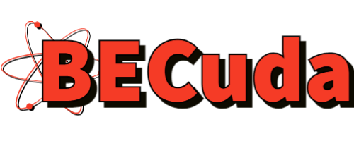

<h4 align="center">A fast and easy to use Gross-Pitaevskii equation solver.</h4>

## Description

BECuda is a CUDA framework for solving the Gross-Pitaevskii equations for use in simulating Bose-Einstein condensate 
systems.

### Planned supported features
- Scalar, spin-1/2, spin-1, and spin-2 systems.
- 1D, 2D, and 3D grid lattices.
- Phase profile constructors that allow for vortices.
- HDF5 data saving system.
- Python diagnostics functions for calculating/using useful quantities.

### Current development
- 2D spin-1 system.

## Examples
- Reserved for the future

## Building
- Reserved for the future.